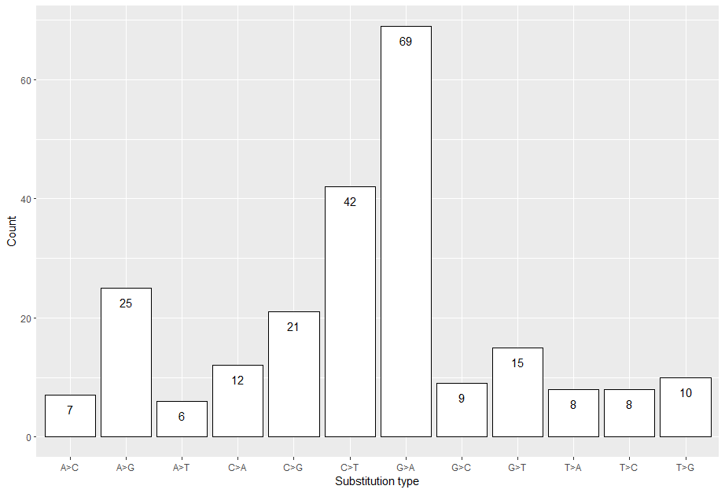

```{r setup, include=FALSE}
library(knitr)
opts_chunk$set(fig.align = "center", 
               out.width = "90%",
               fig.width = 6, fig.height = 5.5,
               dev.args=list(pointsize=10),
               par = TRUE, # needed for setting hook 
               collapse = TRUE, # collapse input & ouput code in chunks
               warning = FALSE)
knit_hooks$set(par = function(before, options, envir)
  { if(before && options$fig.show != "none") 
       par(family = "sans", mar=c(4.1,4.1,1.1,1.1), mgp=c(3,1,0), tcl=-0.5)
})
set.seed(1) # for exact reproducibility
```
       
## Introduction

`diagMutAnalysis` is an R package that takes data formats as same as from the ICGC DCC open database. The aim of the package is to analyze different aspects of the ICGC database analysis and also re-create it in a user friendly R package[https://dcc.icgc.org/].The package provides function on analyzing sample donors by getting the proportion and frequency of all gene mutations that has had an effect. Another function creates plots not existing in the ICGC database as a different perspective to the data. Providing information on frequency and types of cds mutations, and mutation consequence types in a bar plot and pie chart of respective order. **This document gives a tour of diagMutAnalysis (version 0.1.0)**. It was written in R Markdown, using the [knitr](https://cran.r-project.org/package=knitr) package for production. See `help(package = "diagMutAnalysis")` for further details. 

To download **diagMutAnalysis**, use the following commands:

``` r
require("devtools")
devtools::install_github("wjdwogud24/diagMutAnalysis", build_vignettes = TRUE)
library("diagMutAnalysis")
```
To list all sample functions available in the package:
``` r
ls("package:diagMutAnalysis")
```

To list all sample datasets available in the package:
``` r
data(package = "diagMutAnalysis")
```

<br>


## Components

<div style="text-align:center">

## Data

For all functions used in `diagMutAnalysis` package a data set configured correctly needs to be used. Go to [https://dcc.icgc.org/] and find DCC data. The easiest way to use this package is to configure data into similar format as files denoted as simple_somatic_mutation.open.\<Project-code\>.tsv.gz. Without setting it to exactly as same as the suggested data format package is still fully suitable to be used. Need to follow function guidelines, and which object types to use.

## Functions

The function *mutationPercentage* analyzes the provided data by getting the proportion and frequency of all gene mutation's that has had an effect on the sample donors. See *?mutationPercentage* for more information. The example is conducted with the given data icgc_data in the package.

```r
test <- mutationPercentage(icgc_data)

#This returns a dataframe of three columns. gene_affected, mutation_count,
#and percentage_of_sample_with_mutated_gene
#The corresponding data for each Ensembl code in gene_affected is reflected
#onto the mutation_count and percentage_of_sample_with_mutated_gene

test
```
<div style="text-align:center">
<div style="text-align:left">

The function *mutationTypePlot* returns a list with two plots. A bar plot that has analyzed the frequency of all mutation substitution types in donor samples. A pie chart that has analyzed mutation type proportion in the donor samples. Takes one argument the icgc_data data frame will be used in this example.

```r
test_plot <- mutationTypePlot(icgc_data)

#The plot is inside a list can extract it using character indexing.
test_plot["mutation_types"]
test_plot["substitution_types"]
```
<div style="text-align:center">
<div style="text-align:left">


<div style="text-align:center">
<div style="text-align:left">

## Package References

[Jung, J. (2022) diagMutAnalysis: R package that analyzes ICGC data for
  BCB410H: Applied Bioinformatics. R package version 0.1.0.]
  (https://github.com/wjdwogud24/diagMutAnalysis)

<br>

## Other References

* [Hadley Wickham (2022). stringr: Simple, Consistent Wrappers for Common String Operations. R package version 1.4.1.https://CRAN.R-project.org/package=stringr]

* [H. Wickham. ggplot2: Elegant Graphics for Data Analysis. Springer-Verlag New York, 2016]

* [Hadley Wickham, Romain Francois, Lionel Henry and Kirill Muller(2022). dplyr: A Grammar of Data Manipulation. R package version 1.0.10. https://CRAN.R-project.org/package=dplyr]

* [https://dcc.icgc.org/]

----

```{r}
sessionInfo()
```
